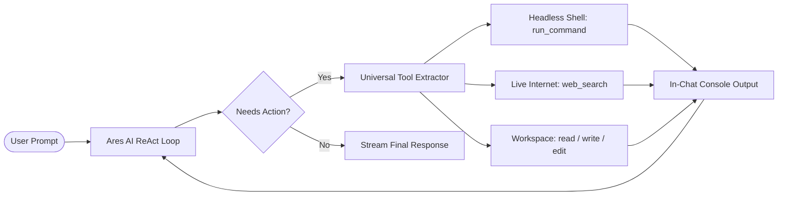

# ⚡ Ares IDE — Core-Native AI Code Editor

<p align="center">
  
</p>

<p align="center">
  <b>A desktop-first, AI-native development environment with 100% core-integrated intelligence.</b><br/>
  Zero Microsoft Copilot dependencies · Zero sign-in modals · Multi-model freedom · Autonomous workspace tools · Silent headless terminal execution · Live internet access.
</p>

<p align="center">
  <a href="#-architecture--worklog-hub"></a>
  <a href="#-active-models--providers"></a>
  <a href="#-core-ai-agent-capabilities"></a>
  <a href="#-getting-started"></a>
</p>

---

## 🌟 Why Ares IDE?

Traditional AI editors either rely on closed-source cloud proxies, require complex extension bridging that breaks across releases, or force developers into mandatory account subscriptions and vendor lock-in.

**Ares IDE** rewrites the rules:
- **100% Core Native**: Chat participants, streaming completions, language model providers, and autonomous tools operate directly inside the VS Code core engine (`src/vs/workbench/contrib/chat/browser/aresAi/`). No extension host IPC overhead.
- **Zero Login Friction**: All Microsoft accounts, sign-in prompts, setup barriers, and telemetry have been permanently stripped from the UI and lifecycle. Launch and code immediately.
- **Model Freedom**: Connect directly to your favorite cloud inference providers (Groq, OpenRouter, NVIDIA NIM) or run completely private and offline with local Ollama or Cloudflare-tunneled Ollama instances.
- **Antigravity-Grade Tooling**: Autonomous multi-step agent loop with headless background terminal execution and direct in-chat console streaming, surgical file patching, and live internet search.

---

## 📑 Project Tracking & Master Worklog

All technical decisions, architectural blueprints, bug investigations, and step-by-step audit logs are rigorously documented in the repository's [`.worklog/`](.worklog) folder:

| Documentation Hub | Description | Primary Document |
| :--- | :--- | :--- |
| 📊 **Current State** | Master single-source-of-truth status, active subsystems, model registry, unlocked flags, and verification history | [`.worklog/CURRENT_STATE.md`](.worklog/CURRENT_STATE.md) |
| 📐 **Architecture Plans** | Design specifications, ReAct loop architecture, internet access protocols, and headless terminal design | [`.worklog/plans/`](.worklog/plans) |
| 📝 **Change Audit Log** | Detailed log of every single change, refactor, and feature addition across the codebase | [`.worklog/changes/`](.worklog/changes) |
| 🐞 **Debugging Chronicles** | Root cause analyses, command traces, and resolutions for tricky runtime and UI challenges | [`.worklog/debugging/`](.worklog/debugging) |

### Key Milestones Documented:
- [x] **Milestone 1**: [Multi-Turn Memory & Core Native Provider](.worklog/CURRENT_STATE.md#a-milestone-1-multi-turn-memory--core-native-provider)
- [x] **Milestone 2**: [Native Tool Execution & Surgical File Patching](.worklog/CURRENT_STATE.md#b-milestone-2-native-tool-execution--surgical-file-patching)
- [x] **Milestone 3**: [Rich Editor Context & File Attachments](.worklog/CURRENT_STATE.md#c-milestone-3-rich-editor-context--attachments)
- [x] **Milestone 4**: [Permanent Cleanup of Legacy Extensions & Secure Storage](.worklog/CURRENT_STATE.md#d-milestone-4-repository-cleanup--key-security)
- [x] **Milestone 5**: [Permanent Removal of Accounts, Sign-Ins & Setup Gates](.worklog/CURRENT_STATE.md#5-total-removal-of-login--accounts-system)
- [x] **Milestone 6**: [Auxiliary Chat View Restoration](.worklog/CURRENT_STATE.md#6-auxiliary-chat-view-pane-fix--verification)
- [x] **Milestone 7**: [Autonomous ReAct Multi-Step Loop](.worklog/changes/2026-10-01-autonomous-agent-tools-and-react-loop.md)
- [x] **Milestone 8**: [Live Internet Access (Web Search & Page Scraper)](.worklog/changes/2026-10-01-add-internet-access-to-ares-ai.md)
- [x] **Milestone 9**: [Headless Background Shell & In-Chat Console Stream](.worklog/changes/2026-10-01-headless-background-terminal-and-chat-console.md)

---

## 🤖 Core AI Agent Capabilities

Ares AI (`@ai`) is not just a chatbot—it is an autonomous engineering pair programmer with full access to your workspace and tools:



### 1. 🖥️ Silent Headless Terminal Execution
- **Zero UI Disruption**: Executes shell commands headlessly (`hideFromUser: true`, `isFeatureTerminal: true`). The bottom IDE terminal panel never pops open or steals your active editor focus.
- **In-Chat Console Stream**: Commands and live stdout/stderr stream directly inside the chat conversation:
  ```console
  $ git status
  On branch main
  Your branch is up to date with 'origin/main'.
  nothing to commit, working tree clean
  ```
- **ANSI & Echo Cleaned**: Raw ANSI escape codes and prompt echoes are automatically stripped for presentation quality.

### 2. 🌐 Live Internet Access
- **`web_search`**: Live internet search engine powered by zero-API-key DuckDuckGo integration. Fetches current documentation, newly released libraries, and error solutions in real-time.
- **`fetch_web_page`**: Scrapes and converts public URLs or API documentation into clean, structured markdown ready for synthesis.

### 3. 🛠️ Workspace & File Operations
- **`read_file`**: Inspects files with line-number slicing for token efficiency.
- **`write_file`**: Creates complete, production-ready files and opens them directly in new editor tabs.
- **`edit_file`**: Performs surgical `<<<<<<< SEARCH ... ======= ... >>>>>>>` block patching on existing files without overwriting untouched code.
- **`list_dir` & `grep_search`**: Explores directory trees and conducts regex code searches across the workspace.

---

## ⚡ Active Models & Providers

Ares IDE comes pre-configured with 13 high-performance models spanning cloud and local execution:

| Provider | Model Identifier | Type / Strengths |
| :--- | :--- | :--- |
| **Groq** | `openai/gpt-oss-120b` | Ultra-fast flagship reasoning & coding |
| **Groq** | `qwen/qwen3.8-27b` | Precision multi-lingual coding |
| **Groq** | `openai/gpt-oss-20b` | High-speed concise completions |
| **Groq** | `llama-3.3-70b-versatile` | General software architecture & refactoring |
| **OpenRouter** | `liquid/lfm-2.5-2.6b:free` | Free lightweight edge model |
| **OpenRouter** | `nvidia/nemotron-3.5-lightning:free` | Free high-throughput coding model |
| **NVIDIA NIM** | `meta/llama-3.2-11b-vision-instruct` | Multimodal code & diagram understanding |
| **Ollama (Tunnel)** | `qwen3.8-27b-uncensored-mtp` | Zero-filter remote GPU execution |
| **Ollama (Tunnel)** | `hf.co/JonathanColetti/Qwen3.8-27B-Uncensored-GGUF:Q4_K_M` | High-accuracy quantized reasoning |
| **Local Ollama** | `qwen2.5-coder:latest` | 100% offline local code intelligence |
| **Local Ollama** | `llama3.2:latest` | 100% offline fast instructions |
| **Local Ollama** | `deepseek-r1:latest` | 100% offline chain-of-thought reasoning |

---

## 🚀 Getting Started

### Prerequisites
- **Node.js**: `v20.x` or `v22.x`
- **npm**: `v10.x` or higher
- **Python**: `3.10+` (required for native node-gyp builds)
- **C/C++ Build Tools**: Visual Studio Build Tools (Windows) / `build-essential` (Linux) / Xcode CLT (macOS)

### 1. Clone the Repository
```bash
git clone https://github.com/Nothing-dot-exe/ares.git
cd ares
```

### 2. Install Dependencies & Transpile
```bash
npm install
npm run transpile-client
```

### 3. Launch Ares IDE Desktop
On Windows, simply double-click or run:
```bat
run.bat
```
*(Or run `npm run electron` to launch via development Electron runner)*.

---

## ⚙️ Configuration & Key Management

Ares IDE manages credentials natively inside your OS keychain and settings store without ever opening external browser authentication tabs:

```json
{
  "aresAi.model": "openai/gpt-oss-120b",
  "chat.checkpoints.enabled": true,
  "chat.artifacts.enabled": true,
  "chat.tools.terminal.enableAutoApprove": true
}
```

To configure your API keys, run the native command palette shortcut:
- `Ctrl+Shift+P` -> `Ares AI: Set API Key`
- Select your provider (**Groq**, **OpenRouter**, **NVIDIA NIM**) and paste your token.
- Local Ollama and Tunnel instances connect automatically with zero configuration.

---

## 🏛️ Repository Structure

```
.
├── .worklog/                       # Complete project tracking & audit records
│   ├── CURRENT_STATE.md            # Single source of truth master document
│   ├── plans/                      # Architectural designs & specifications
│   ├── changes/                    # Incremental change logs per feature
│   └── debugging/                  # Incident reports & debugging chronicles
├── src/vs/workbench/contrib/chat/  # Core Chat Subsystem
│   └── browser/aresAi/             # Core Native Ares AI engine
│       ├── aresAiAgent.ts          # Autonomous ReAct agent & headless tool execution
│       ├── aresAiClient.ts         # High-speed streaming client (SSE / fetch)
│       ├── aresAiKeyManager.ts     # In-app OS keychain & secret manager
│       ├── aresAiLanguageModelProvider.ts # Native ILanguageModelChatProvider
│       └── aresAiTypes.ts          # Provider registries, schemas & models
├── scripts/                        # Automated verification & test suites
├── run.bat                         # Production Electron desktop launcher
└── package.json                    # Workspace dependencies & build scripts
```

---

## 📄 License & Attribution

Ares IDE is built upon the open-source Visual Studio Code architecture.  
Licensed under the [MIT License](LICENSE.txt).
